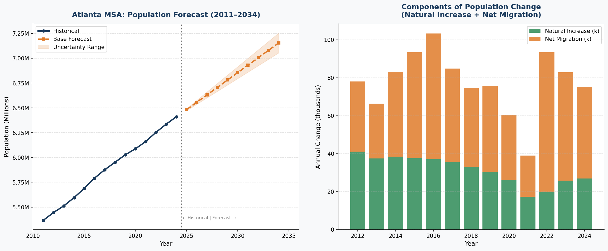

# Atlanta MSA — 10-Year Population Forecast

**Research & Investment Project**  
Atlanta–Sandy Springs–Roswell, GA Metropolitan Statistical Area  
Forecast Period: 2025–2034 | Data: U.S. Census Bureau (2024 vintage)

---

## Summary

This project forecasts the total population of the Atlanta MSA 10 years ahead from the most recent available Census data.

**Key result:** The Atlanta MSA is projected to grow from **6.41 million (2024)** to **7.16 million by 2034** — an increase of ~744,000 people (+11.6%), driven primarily by sustained net in-migration averaging ~47,000 persons per year.

| Year | Low Scenario | Base Forecast | High Scenario |
|------|-------------|---------------|---------------|
| 2025 | 6,472,667 | 6,482,667 | 6,492,667 |
| 2027 | 6,602,090 | 6,632,090 | 6,662,090 |
| 2030 | 6,796,223 | 6,856,223 | 6,916,223 |
| 2034 | 7,055,069 | **7,155,069** | 7,255,069 |

---

## Methodology

A **dual-model blended approach** was used:

1. **Holt's Linear Exponential Smoothing** — a time-series model that captures both level and trend. Parameters (α=0.10, β=0.05) were selected by grid-search RMSE minimisation on the historical series (in-sample RMSE: ~71,000, or <1.2% of population).

2. **Demographic Component Model** — extrapolates population using the standard identity:  
   `P(t) = P(t-1) + Natural Increase + Net Migration`  
   using 5-year averages (2020–2024): natural increase ~23,242/yr, net migration ~47,011/yr.

3. **Age-Structure Cross-Check** — the Census age-by-year file (2020–2025) was used to validate cohort composition and confirm the declining natural increase assumption.

The base forecast is the equal-weighted blend of both models. Scenarios vary net migration by ±20,000 persons/year.

---

## Repository Structure

```
├── atlanta_forecast.py            # Main analysis script (fully reproducible)
├── Atlanta.csv                    # Historical population + components (2011–2024)
├── cbsa-est2024-syasex.csv        # Age-structure data by single year of age (2020–2025)
├── atlanta_population_table.csv   # Full output table (historical + 10-year forecast)
├── atlanta_forecast.png           # Charts: forecast with uncertainty band + components
└── Atlanta_MSA_Population_Forecast.docx  # Full written report
```

---

## How to Reproduce

**Requirements:** Python 3.8+, with `pandas`, `numpy`, and `matplotlib`

```bash
# Clone the repository
git clone https://github.com/YOUR_USERNAME/atlanta-population-forecast.git
cd atlanta-population-forecast

# Install dependencies (if needed)
pip install pandas numpy matplotlib

# Run the analysis
python3 atlanta_forecast.py
```

**Outputs generated:**
- `atlanta_forecast.png` — two-panel chart (forecast + components of change)
- `atlanta_population_table.csv` — full historical + forecast table with scenarios

No proprietary libraries or licensed packages required. The Holt smoothing and component models are implemented from scratch using `numpy`.

---

## Data Sources

- **Annual population totals & components of change:**  
  U.S. Census Bureau, Population Estimates Program — Metro & Micro Statistical Areas (2020s vintage)  
  https://www.census.gov/data/tables/time-series/demo/popest/2020s-total-metro-and-micro-statistical-areas.html

- **Age-by-single-year estimates:**  
  U.S. Census Bureau, Population Estimates — CBSA by Age and Sex (2024 vintage)  
  https://www.census.gov/data/tables/time-series/demo/popest/2020s-metro-and-micro-statistical-areas-detail.html

---

## Key Findings

- **Migration dominates:** Net migration accounts for ~65% of Atlanta's annual population growth. This is the primary driver and the largest source of forecast uncertainty.
- **Natural increase declining:** Births minus deaths has fallen from 41,748 (2011) to 26,916 (2024) as the population ages — a structural trend expected to continue.
- **International migration rising:** In 2024, international arrivals (+49,691) more than offset a net domestic outflow (-1,328), reflecting Atlanta's growing role as an international gateway city.
- **Primary risk:** Housing affordability erosion is the most likely factor that could reduce in-migration and push outcomes toward the low scenario.

---

## Visualisation



*Left: Historical population (2011–2024) with 10-year base forecast and uncertainty range.  
Right: Annual components of change — natural increase and net migration (2012–2024).*
